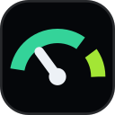

<div align="center">

<a href="https://skor-risiko.pages.dev/"></a>

# Skor Risiko

**Tahu risikonya sebelum ikut membeli.**

Bot Telegram yang menilai risiko saham IDX dari 28 indikator, lalu menjelaskannya dengan bahasa sehari-hari untuk investor pemula.

**[Website](https://skor-risiko.pages.dev/)** · [Panduan instalasi](https://skor-risiko.pages.dev/docs/) · [Kontribusi](CONTRIBUTING.md)

[](https://skor-risiko.pages.dev/)
[](LICENSE)


</div>

> **English summary.** Skor Risiko is a self-hosted Telegram bot that scores the risk of Indonesian (IDX) stocks with 28 sourced indicators across six pillars, then explains the result in plain Indonesian for beginner investors. Code computes every number; the LLM only narrates, and a number gate drops any sentence whose figures cannot be traced back to the computed data. The documentation is written in Indonesian.

> [!IMPORTANT]
> Skor Risiko bukan rekomendasi beli atau jual dan tidak memprediksi harga. **Skor tinggi berarti risiko tinggi.**

## Daftar isi

- [Kenapa ada proyek ini](#kenapa-ada-proyek-ini)
- [Fitur](#fitur)
- [Cara kerja](#cara-kerja)
- [Yang dinilai](#yang-dinilai)
- [Mulai cepat](#mulai-cepat)
- [Konfigurasi](#konfigurasi)
- [Perintah pengembangan](#perintah-pengembangan)
- [Struktur repositori](#struktur-repositori)
- [Batasan](#batasan)
- [Kontribusi](#kontribusi)
- [Lisensi dan data pihak ketiga](#lisensi-dan-data-pihak-ketiga)

## Kenapa ada proyek ini

Informasi risiko sebuah saham sebenarnya tersedia, tapi tersebar dan teknis: laporan keuangan, notasi khusus dan Papan Pemantauan Khusus dari BEI, suspensi, aksi korporasi, sampai berita. Investor pemula jarang tahu harus mulai dari mana, dan angka seperti "PBV 2,9" tidak menjawab pertanyaan yang sebenarnya: seberapa besar risiko saham ini? Screener pun menuntut kita tahu apa yang dicari, dan tidak ada yang memberi tahu saat kondisi saham yang sudah dipegang berubah.

Skor Risiko merangkum semua itu dalam satu kartu di Telegram: skor 0–100, grade A sampai E, dan satu kalimat penjelasan untuk setiap indikator. Setiap ambang punya sumber, setiap angka di penjelasan bisa ditelusuri asalnya, dan bot memberi kabar sendiri saat kondisi saham yang dipantau berubah.

## Fitur

| Perintah        | Kegunaan                                                                             |
| --------------- | ------------------------------------------------------------------------------------ |
| `/risk KODE`    | Nilai satu saham kapan saja, misalnya `/risk ANTM`. Jawabannya muncul di chat utama. |
| `/regis KODE`   | Pantau saham. Bot membuat topik khusus untuk saham itu dan mengirim kartu skor awal. |
| `/list`         | Daftar saham yang dipantau: kode, skor, grade, dan arah perubahan.                   |
| `/unregis KODE` | Berhenti memantau. Topiknya ditutup, bukan dihapus.                                  |

- **Alert pagi.** Pukul 06.00 WIB Senin–Jumat, bot memeriksa saham yang dipantau dan hanya mengirim kabar bila grade berpindah, skor bergeser 10 poin atau lebih, indikator bersumber regulator jadi bermasalah, atau ada berita, filing, atau suspensi baru.
- **Membatalkan alarm palsu.** Lonjakan volume atau harga yang punya penjelasan wajar (bergerak bersama mayoritas saham sesubsektor, jatuh di tanggal ex-dividen, atau ada beritanya) tetap ditampilkan, tapi tidak dihitung dalam skor.
- **Setiap angka punya kuitansi.** Ambang regulator disebut nomor peraturannya. Yang tidak punya sumber resmi diturunkan dari persentil data dan ditandai begitu.
- **Gerbang angka.** Kalimat AI yang angkanya tidak ada di data, atau berisi ajakan beli dan jual, dibuang sebelum dikirim.
- **Tahan gagal.** Kalau AI gagal atau terlambat, bot mengirim kartu cadangan tanpa AI. Kalau topik gagal dibuat, pesan dikirim ke chat utama.
- **Mode offline.** Data contoh per 22 September 2026 ikut di repositori, jadi bot, tes, dan demo bisa dijalankan tanpa kredit API.

## Cara kerja

<a href="https://skor-risiko.pages.dev/#cara-kerja"></a>

<p align="center"><sub>Klik diagram untuk mencoba demo gerbang angka di website.</sub></p>

Kode menghitung semua angka. AI hanya menulis penjelasannya. Data yang sama selalu menghasilkan `indicators.json` yang sama, byte per byte. Klik setiap langkah untuk melihat rinciannya, atau baca [docs/ARCHITECTURE.md](docs/ARCHITECTURE.md) untuk penjelasan lengkap.

<details>
<summary><b>01 · Pemicu</b>: <code>/risk</code>, <code>/regis</code>, atau putaran 06.00 WIB</summary>

Penilaian dimulai saat pengguna mengetik `/risk` atau `/regis`, atau saat putaran harian berjalan pukul 06.00 WIB Senin–Jumat. Kode saham dicek dulu ke daftar emiten lokal, dan kode yang salah dijawab dengan saran terdekat.

Kode: `bot/telegram/handlers.py`, `bot/telegram/services.py`, `bot/jobs/rounds.py`

</details>

<details>
<summary><b>02 · Snapshot data</b>: Sectors API dan data BEI</summary>

Harga, laporan keuangan, kepemilikan, ringkasan broker, berita, filing, suspensi, dan aksi korporasi diambil dari Sectors API, lalu digabung dengan daftar notasi khusus dan HSC dari BEI. Snapshot disimpan di SQLite, dan data harian di-cache per tanggal supaya tidak memakan kredit dua kali.

Kode: `bot/snapshot/build.py`, `bot/sectors/client.py`, `bot/idx/`

</details>

<details>
<summary><b>03 · Mesin aturan</b>: 28 indikator, skor, dan grade</summary>

Setiap indikator adalah fungsi murni yang membandingkan data dengan ambang bersumber, lalu memberi status kuat, wajar, perhatian, atau bermasalah. Bendera yang punya penjelasan wajar dibatalkan, kemudian skor pilar, skor akhir, dan grade dihitung.

Kode: `bot/risk/indicators/`, `bot/risk/thresholds.py`, `bot/risk/dismiss.py`, `bot/risk/score.py`

</details>

<details>
<summary><b>04 · indicators.json</b>: satu-satunya masukan untuk AI</summary>

Hasil hitungan dirangkum dalam satu dokumen berisi status, angka yang sudah diformat, ambang, dan sumber tiap indikator. Determinismenya dijaga tes golden untuk 8 emiten uji.

Kode: `bot/risk/build_json.py`, `tests/golden/`

</details>

<details>
<summary><b>05 · AI + skill</b>: narasi untuk pemula</summary>

Prompt dirangkai dari skill `analisis-risiko-saham` (aturan nada, kamus istilah, contoh) dan `indicators.json` yang dibungkus sebagai data. AI menulis ringkasan, vonis per pilar, dan satu kalimat untuk setiap indikator, lewat API apa pun yang kompatibel dengan OpenAI.

Kode: `skills/analisis-risiko-saham/`, `bot/narrate/prompt.py`, `bot/narrate/llm.py`

</details>

<details>
<summary><b>06 · Gerbang angka</b>: setiap angka harus terlacak</summary>

Setiap kalimat AI diperiksa. Angkanya harus ada di `indicators.json` dengan satuan yang sama, dan kalimat berisi ajakan beli atau jual, tautan, atau akun media sosial dibuang. Contoh hasil asli gerbang pada data CASH:

| Kalimat dari AI | Hasil |
|---|---|
| Liabilitasnya 3,38× modal sendiri pada 2025, jauh di atas batas saham sejenis 0,88×. | lolos |
| Harga CASH bisa naik 45% dalam sebulan ke depan. | dibuang: 45% tidak ada di data |
| Sebaiknya segera jual CASH sebelum harganya turun. | dibuang: ajakan jual |

Kode: `bot/narrate/gate.py`

</details>

<details>
<summary><b>07 · Kartu Telegram</b>: satu topik per saham</summary>

Jawaban `/risk` dikirim ke chat utama, sedangkan kartu `/regis` dan alert dikirim ke topik saham itu. Pesan dipecah di batas pilar supaya tidak melewati 4.096 karakter. Kalau AI gagal, terlambat, atau hasilnya ditolak Telegram, kartu cadangan tanpa AI yang dikirim.

Kode: `bot/telegram/render.py`, `bot/telegram/render_fallback.py`

</details>

## Yang dinilai

28 indikator dibagi ke 6 pilar. Katalog lengkap beserta ambang dan sumbernya ada di [PRD bagian 10](docs/PRD.md#10-katalog-28-indikator).

| Pilar                       | Indikator | Contoh                                                               |
| --------------------------- | --------- | -------------------------------------------------------------------- |
| Ukuran dan likuiditas       | 6         | free float, likuiditas harian, lonjakan volume                       |
| Kesehatan keuangan          | 5         | ekuitas negatif, Altman Z'', Piotroski F. Bank memakai CAR, LDR, NIM |
| Valuasi                     | 3         | PER dan PBV dibanding sejenis, Graham Number                         |
| Kepemilikan dan orang dalam | 4         | penjualan orang dalam, kepemilikan terkonsentrasi (HSC)              |
| Perilaku harga              | 4         | sentuhan ARA/ARB, volatilitas dan penurunan terdalam 90 hari         |
| Peristiwa dan berita        | 6         | notasi khusus BEI, Papan Pemantauan Khusus, suspensi, berita negatif |

Menurut sumber ambangnya, 9 indikator bersumber regulator (BEI, OJK, BI), 6 dari riset akademik, dan 13 diturunkan dari data.

**Skor dan grade.** Skor pilar adalah bobot indikator bermasalah dibagi bobot indikator yang bisa dinilai, dikali 100. Skor akhir adalah rata-rata skor pilar. Indikator yang datanya kosong atau tidak cocok untuk sektornya dikeluarkan dari pembagi, bukan dianggap nol.

| Skor  | 0–20 | 21–40 | 41–60 | 61–80 | 81–100 |
| ----- | ---- | ----- | ----- | ----- | ------ |
| Grade | A    | B     | C     | D     | E      |

## Mulai cepat

### Yang perlu disiapkan

- Docker Compose, atau Python 3.11+ dengan [uv](https://docs.astral.sh/uv/).
- Bot Telegram dari [@BotFather](https://t.me/BotFather).
- API key [Sectors Financial API](https://sectors.app/). Setiap panggilan data memakai kredit.
- Opsional: endpoint LLM yang kompatibel dengan OpenAI untuk narasi AI.

### 1. Ambil kode

```bash
git clone https://github.com/iqbal-rahmatullah/idx-skor-risiko.git
cd idx-skor-risiko
```

### 2. Siapkan bot di @BotFather

1. Kirim `/newbot`, pilih nama dan username, lalu simpan tokennya.
2. Di pengaturan bot (Mini App @BotFather), nyalakan **Threaded Mode** supaya bot bisa membuat satu topik per saham.
3. Di pengaturan yang sama, matikan izin pengguna membuat dan menghapus topik. Topik hanya dibuat oleh bot.

Daftar perintah bot dipasang otomatis setiap bot menyala.

### 3. Isi `.env`

```bash
cp .env.example .env
```

Isi minimal `TELEGRAM_BOT_TOKEN` dan `SECTORS_API_KEY`. Bawaan `.env.example` adalah `SECTORS_OFFLINE=true` (data contoh, tanpa kredit); ubah ke `false` untuk data sungguhan. Penjelasan semua variabel ada di [Konfigurasi](#konfigurasi).

### 4. Jalankan

**Dengan Docker (disarankan):**

```bash
docker compose up -d --build
docker compose logs -f        # tunggu baris: Application started
```

Database SQLite disimpan di volume `skor-risiko_data`, dan `restart: unless-stopped` menyalakan bot lagi setelah crash atau server restart.

**Tanpa Docker:**

```bash
uv sync
uv run python -m bot
```

<details>
<summary>Menjalankan sebagai layanan systemd (server Linux tanpa Docker)</summary>

Sesuaikan user dan path-nya; cari lokasi uv dengan `which uv`. Berkas `.env` dibaca dari `WorkingDirectory`.

```ini
# /etc/systemd/system/skor-risiko.service
[Unit]
Description=Skor Risiko (bot Telegram)
After=network-online.target
Wants=network-online.target

[Service]
User=skorrisiko
WorkingDirectory=/opt/idx-skor-risiko
ExecStart=/home/skorrisiko/.local/bin/uv run python -m bot
Restart=on-failure
RestartSec=10

[Install]
WantedBy=multi-user.target
```

```bash
sudo systemctl daemon-reload
sudo systemctl enable --now skor-risiko
journalctl -u skor-risiko -f
```

</details>

Setelah bot menyala, buka chat dengannya, kirim `/start`, lalu coba `/risk BBCA`.

> [!WARNING]
> Bot belum punya daftar izin pengguna, pembatas laju, atau batas jumlah saham. Siapa pun yang tahu username botmu bisa memakainya dan menghabiskan kredit Sectors-mu. `/regis` pertama memakai sekitar 55 kredit, dan putaran harian sekitar 15 kredit per saham terdaftar. Bagikan bot hanya ke orang yang kamu percaya.

### Perawatan

| Keperluan                     | Docker                                                     | Tanpa Docker                         |
| ----------------------------- | ---------------------------------------------------------- | ------------------------------------ |
| Kirim putaran harian sekarang | `docker compose exec bot python -m bot.jobs harian`        | `uv run python -m bot.jobs harian`   |
| Perbarui notasi khusus BEI    | `docker compose exec bot python -m bot.jobs mingguan`      | `uv run python -m bot.jobs mingguan` |
| Perbarui ke versi terbaru     | `git pull && docker compose up -d --build`                 | `git pull && uv sync`, lalu restart  |
| Cadangkan database            | `docker compose cp bot:/data/skor-risiko.db ./cadangan.db` | salin `sectors_hackathon.db`         |

`docker compose down -v` ikut menghapus volume beserta database.

## Konfigurasi

Semua konfigurasi dibaca dari `.env` (lihat [.env.example](.env.example)).

| Variabel                                   | Wajib | Keterangan                                                                                                                                             |
| ------------------------------------------ | ----- | ------------------------------------------------------------------------------------------------------------------------------------------------------ |
| `TELEGRAM_BOT_TOKEN`                       | ya    | Token dari @BotFather.                                                                                                                                 |
| `SECTORS_API_KEY`                          | ya    | API key Sectors Financial API.                                                                                                                         |
| `SECTORS_OFFLINE`                          | tidak | `false` (bawaan) memakai data langsung dan kredit. `true` membaca data contoh di `tests/fixtures/` tanpa kredit.                                       |
| `LLM_BASE_URL`, `LLM_API_KEY`, `LLM_MODEL` | tidak | Endpoint OpenAI-compatible untuk narasi AI, misalnya OpenAI, OpenRouter, Groq, atau model lokal lewat vLLM dan Ollama. Kosongkan untuk kartu tanpa AI. |
| `LLM_TIMEOUT`                              | tidak | Batas waktu narasi dalam detik, bawaan 180.                                                                                                            |
| `DATABASE_URL`                             | tidak | Bawaan `sqlite:///sectors_hackathon.db`. Di Docker diatur ke `sqlite:////data/skor-risiko.db`.                                                         |

Kalau LLM berjalan di mesin yang sama dengan container Docker, pakai `http://host.docker.internal:<port>/v1`, karena `localhost` di dalam container menunjuk ke container itu sendiri.

## Perintah pengembangan

```bash
uv sync                                                  # pasang dependensi, termasuk grup dev
uv run pytest                                            # semua tes, tanpa jaringan
uv run ruff check . && uv run ruff format .              # lint dan format
SECTORS_OFFLINE=true uv run python -m bot.risk ANTM      # cetak indicators.json dari data contoh
SECTORS_OFFLINE=true uv run python -m bot.narrate ANTM   # narasi AI + kalimat yang dibuang gerbang
SECTORS_OFFLINE=true uv run python -m bot.demo           # skenario demo dua momen, offline
uv run python -m scripts.regen_golden                    # buat ulang golden; periksa git diff
uv run python -m scripts.record_fixtures BBCA            # rekam fixture baru (live, memakai kredit)
```

## Struktur repositori

```
bot/                  kode bot: snapshot, mesin aturan, narasi, Telegram, putaran terjadwal
  risk/indicators/    satu modul per pilar (p1_ukuran.py ... p6_peristiwa.py)
  risk/thresholds.py  semua ambang beserta sumber dan tanggal berlakunya
  narrate/gate.py     gerbang angka
skills/               skill narasi: SKILL.md, kamus istilah, aturan nada, contoh
tests/                tes pytest, fixture respons Sectors asli, golden 8 emiten
scripts/              rekam fixture, buat ulang golden, perbarui daftar emiten
docs/                 PRD dan arsitektur
Dockerfile, compose.yaml
```

## Batasan

- Data bergantung pada Sectors Financial API. Beberapa field sering kosong; indikator yang datanya kosong berstatus "tidak terdata" dan tidak ikut dihitung.
- Skor Piotroski sering tidak bisa dihitung karena data utang jangka panjang hampir selalu kosong.
- UMA belum tercakup karena tidak tersedia di Sectors. Daftar saham terkonsentrasi tinggi (HSC) diperbarui manual.
- Data harian, bukan real-time. Alert hanya dikirim di putaran 06.00 WIB.

## Kontribusi

Kontribusi sangat diterima, dari laporan bug, usulan indikator, sampai perbaikan teks. Baca [CONTRIBUTING.md](CONTRIBUTING.md) dulu, terutama aturan inti: skor dihitung kode, setiap ambang punya sumber, dan tidak ada rekomendasi beli atau jual. Yang memakai agen AI untuk membantu coding bisa membaca [AGENTS.md](AGENTS.md).

Laporan keamanan jangan dibuka sebagai issue publik; ikuti [SECURITY.md](SECURITY.md). Semua kontributor diharapkan mengikuti [Kode Etik](CODE_OF_CONDUCT.md).

## Lisensi dan data pihak ketiga

- Kode proyek ini dirilis dengan [lisensi MIT](LICENSE).
- `tests/fixtures/` berisi respons asli Sectors Financial API, termasuk judul dan cuplikan berita, yang dipakai untuk tes. Hak atas data tersebut tetap milik pemiliknya.
- Data di `bot/data/idx/` disusun dari informasi publik Bursa Efek Indonesia.

Terima kasih kepada [Sectors](https://sectors.app/), [python-telegram-bot](https://python-telegram-bot.org/), dan [uv](https://docs.astral.sh/uv/).
