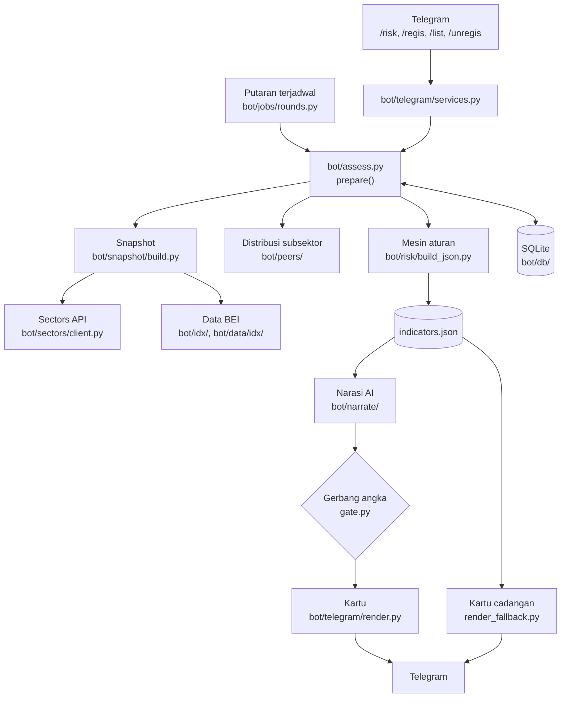

# Arsitektur

Dokumen ini menjelaskan bagaimana data mengalir di Skor Risiko dan di mana tiap bagian berada. Aturan yang wajib diikuti saat mengubah kode ada di [AGENTS.md](../AGENTS.md); spesifikasi produk ada di [PRD](PRD.md).

## Gambaran besar

Prinsipnya: **kode menghitung semua angka, AI hanya menarasikan.** Satu-satunya masukan untuk AI adalah `indicators.json`, dan keputusan apa pun (status, skor, grade, pembatalan bendera, pemicu alert) diambil kode.

## Lapisan

| Lapisan | Lokasi | Tugas |
|---|---|---|
| Klien data | `bot/sectors/` | Memanggil Sectors API `/v2` dengan jeda dan percobaan ulang. Di mode offline membaca `tests/fixtures/sectors/` (bisa ditimpa overlay untuk demo). |
| Data BEI | `bot/idx/`, `bot/data/idx/` | Notasi khusus (diperbarui mingguan dari idx.id, ditulis atomik) dan daftar HSC (manual). |
| Snapshot | `bot/snapshot/` | Mengambil, menormalkan, dan menyimpan `TickerSnapshot`: harga, keuangan, kepemilikan, broker, peristiwa. Data EOD di-cache per `(symbol, as_of)`; berita, filing, dan suspensi selalu diambil ulang. |
| Distribusi subsektor | `bot/peers/` | Satu panggilan screener per subsektor dan `/daily` anggota subsektor, lalu persentil (`PeerStats`) untuk ambang berbasis data. |
| Mesin aturan | `bot/risk/` | 28 indikator sebagai fungsi murni per pilar (`indicators/p1_*.py` ... `p6_*.py`), ambang dan sumbernya (`thresholds.py`), skor dan grade (`score.py`), pembatalan bendera (`dismiss.py`), pembanding hari sebelumnya dan pemicu alert (`compare.py`), lalu `build_json.py` merangkai `indicators.json`. |
| Narasi | `bot/narrate/`, `skills/` | Prompt dirangkai dari `SKILL.md` dan `references/`, dikirim ke LLM OpenAI-compatible, keluarannya di-parse defensif lalu disaring gerbang angka. |
| Telegram | `bot/telegram/` | Handler perintah, alur layanan, pembuatan topik, dan render kartu (dengan AI atau cadangan), dipecah di batas 4.096 unit UTF-16. |
| Penjadwalan | `bot/jobs/` | Putaran harian 06.00 WIB Senin–Jumat dan putaran mingguan Senin 05.00 lewat JobQueue python-telegram-bot. |
| Penyimpanan | `bot/db/` | SQLite lewat SQLAlchemy: snapshot, dokumen risiko, harga, broker, distribusi, registrasi, peristiwa yang sudah dikirim, dan waktu putaran per pengguna. Tabel dibuat otomatis saat bot menyala. |

## Alur `/risk KODE`

1. Kode saham divalidasi terhadap `bot/data/tickers.json`. Kode yang salah dijawab dengan saran terdekat.
2. Bot mengirim tanda terima "⏳ Menilai KODE… hasil menyusul."
3. `prepare()` membuat snapshot. Distribusi subsektor dan riwayat broker hanya diisi bila diminta (mode offline, atau backfill saat `/regis`), karena di mode live keduanya memakan kredit.
4. `build_indicators()` menghitung ke-28 indikator, menerapkan pembatalan bendera, lalu menghitung skor dan grade. `annotate()` membandingkan dengan dokumen hari bursa sebelumnya untuk mengisi `is_new` dan `since`. Dokumennya disimpan.
5. Bila LLM dikonfigurasi, narasi dibuat dan disaring gerbang angka. Kalau LLM gagal, lewat batas waktu, keluarannya tidak bisa di-parse, hasilnya melebihi batas pesan, atau Telegram menolaknya, kartu cadangan yang dikirim.

## Alur `/regis KODE`

1. Bot membuka ulang topik lama atau membuat topik baru bernama kode saham, lalu menyimpan `message_thread_id` per `(user_id, ticker)`. Kalau topik gagal dibuat, saham tetap terdaftar dan pesan dikirim ke chat utama.
2. Penilaian awal berjalan seperti `/risk`, ditambah backfill 20 hari riwayat broker, dan kartunya dikirim ke topik sebagai titik acuan.

## Putaran harian

1. Ambil snapshot semua saham terdaftar. Kegagalan satu saham dicatat dan dilewati.
2. Hentikan putaran bila tanggal EOD terbaru belum maju dari putaran sebelumnya. Karena itu hari libur bursa tidak perlu didaftarkan.
3. Hitung ulang dokumen setiap saham dan bandingkan dengan dokumen sebelumnya.
4. Untuk setiap pengguna, kumpulkan pemicu alert (grade berpindah, skor bergeser 10 poin atau lebih, indikator regulator jadi bermasalah) dan peristiwa baru sejak putaran terakhirnya. Peristiwa dan pemicu dideduplikasi lewat tabel peristiwa terkirim.
5. Kirim satu pesan per saham ke topiknya. Narasi AI dibuat sekali per saham yang memang akan dikirimi alert.
6. Waktu putaran pengguna hanya maju bila semua sahamnya tuntas.

## Putaran mingguan

Memperbarui daftar notasi khusus BEI dari idx.id (CSV lama tetap dipakai bila gagal), lalu memperbarui distribusi subsektor untuk semua saham terdaftar.

## Determinisme dan golden

Snapshot yang sama selalu menghasilkan `indicators.json` yang identik byte per byte. `tests/golden/` menyimpan hasil yang sudah diperiksa manual untuk 8 emiten uji (ANTM, BBCA, AEGS, BBRI, BMRI, BIKE, CASH, GOTO), yang mencakup bank, Papan Akselerasi, Papan Pemantauan Khusus, dan saham yang disuspensi. Tes membaca salinan beku data BEI di `tests/fixtures/idx/` supaya pembaruan mingguan tidak menggeser golden.

## Mode offline dan demo

Dengan `SECTORS_OFFLINE=true`, klien membaca fixture tanpa memakai kredit, dan fixture yang tidak ada langsung gagal. `bot/demo.py` membangkitkan "hari bursa berikutnya" sebagai overlay di atas fixture asli untuk memutar dua momen demo: alert dengan alasan kuat dan bendera yang dibatalkan.
